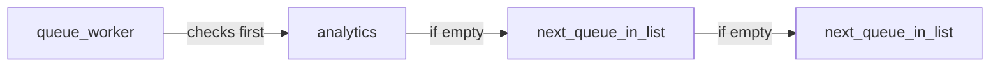

# Queue tutorial: multi-queue workers demo

## Context in this repo

- Default queue connection is already `database` ([config/queue.php](config/queue.php)); `jobs` table exists ([database/migrations/0001_01_01_000002_create_jobs_table.php)).
- Follow existing patterns: jobs use `ShouldQueue` + `Queueable` (see [app/Jobs/FetchTrendingRepositoriesJob.php](app/Jobs/FetchTrendingRepositoriesJob.php)); commands use PHP 8 `#[Signature]` / `#[Description]` (see [app/Console/Commands/FetchTrendingRepositoriesCommand.php](app/Console/Commands/FetchTrendingRepositoriesCommand.php)).

## Critical behavior: `--queue=` is priority, not “fair share”

Laravel’s worker checks queues **in the order listed** and only moves to the next queue when the current one has **no** available jobs.

So `**--queue=analytics,email,reports`** means: drain **all** `analytics` jobs first, then **all** `email`, then `reports`. A report dispatched “between” analytics and email will **not** run between them on that worker—it runs **after** both queues are empty.

Implications for your live demo:

| Worker `--queue=`         | What the audience sees in logs (single worker)                                             |
| ------------------------- | ------------------------------------------------------------------------------------------ |
| `analytics,email,reports` | All analytics → all emails → report (report **does not** delay emails)                     |
| `analytics,reports,email` | All analytics → report(s) → all emails (report **can** delay emails after analytics drain) |

**Recommendation:** Keep job **names** and **named queues** (`analytics`, `email`, `reports`) as you described, but choose worker CLI order to match the story:

- To show **“long report blocks user-facing work on the same worker”** after analytics: use `--queue=analytics,reports,email` on the worker that also processes reports.
- To show **“reports always wait until UX queues are empty”** (good default in production): use `--queue=analytics,email,reports`.

You can still run your two-terminal demo exactly as you outlined; just align the **second** scenario with one of the rows above so the log matches your narration.

## Implementation

### 1. Three job classes (`app/Jobs/`)

Create dedicated classes (names can be tutorial-scoped, e.g. `TutorialAnalyticsJob`, `TutorialEmailJob`, `TutorialReportJob`) that:

- Implement `ShouldQueue` and use `Queueable`.
- Set the queue in the constructor with `$this->onQueue('analytics'|'email'|'reports')` so `dispatch()` is always correct.
- `handle()`:
  - Analytics / Email: `sleep(3);` then `Log::info('Log from job {name}');` with a stable display name (e.g. `"TutorialAnalytics"`).
  - Report: `sleep(8);` then the same log pattern.

No extra dependencies; explicit return type `void` on `handle()`.

### 2. Console command (`app/Console/Commands/`)

Add one command, e.g. `queue:tutorial-dispatch` (or similar), using `#[Signature]` / `#[Description]` like existing commands.

**Dispatch sequence** (7 jobs total, matching your script):

1. Three analytics jobs
2. One report job
3. Three email jobs

Use the static `Job::dispatch()` style already used in [app/Console/Commands/FetchTrendingRepositoriesCommand.php](app/Console/Commands/FetchTrendingRepositoriesCommand.php).

Output a short line to stdout confirming counts so the presenter sees immediate feedback.

### 3. Presenter cheat sheet (no new markdown file)

When implementing, a **code comment block at the top of the command** (2–4 lines) is enough to remind you of the two worker lines you want to paste in terminals—unless you prefer to keep that only in your talk track.

Suggested commands aligned with your story:

- **Both workers process everything (compete on UX; only one takes reports):**  
`php artisan queue:work database --queue=analytics,email,reports`  
`php artisan queue:work database --queue=analytics,email,reports`
- **Split: one worker UX-only, one does UX + reports:**  
`php artisan queue:work database --queue=analytics,email`  
`php artisan queue:work database --queue=analytics,email,reports`

(Adjust the middle segment to `reports` position per the priority table if you need the report to sit **between** analytics and email in **execution** order.)

## Files to add/change

| Area                                           | Action                 |
| ---------------------------------------------- | ---------------------- |
| [app/Jobs/](app/Jobs/)                         | Add 3 new job classes  |
| [app/Console/Commands/](app/Console/Commands/) | Add 1 dispatch command |

No changes to [config/queue.php](config/queue.php) unless you want named default queues in `.env` for something else (not required).

## Verification

- `vendor/bin/pint --dirty` on touched PHP files
- Optional manual check: run the dispatch command, start workers, `tail -f storage/logs/laravel.log` (no Pest/feature tests for this tutorial)

