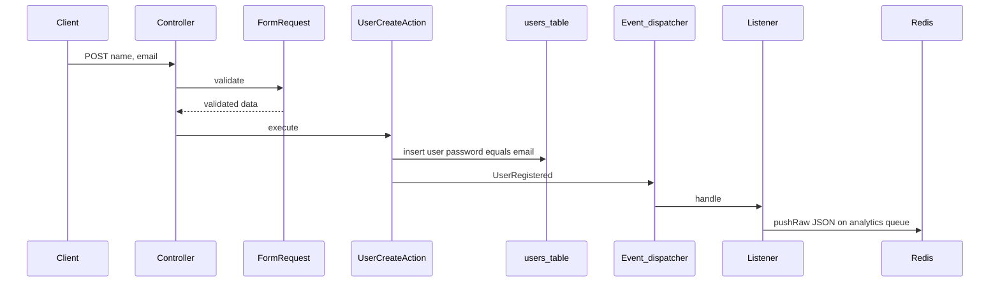

# Backend plan: User registration → `UserRegistered` → `pushRaw`

## Terminology (draft vs architecture)

The draft at line 110 says “dispatch a job … using `pushRaw`.” The [plan](plans/05-async-analytics-consumer.md) already defines **no Job class**: the listener pushes **raw JSON** so a separate consumer (or `queue:work`) is not tied to Laravel’s job envelope. This backend step should implement **raw JSON only**, analogous to `order.placed`.

## Target flow




## Files to add or touch


| Piece        | Location                                                                                                               | Notes                                                                                                                                                                                                                                                                                                                          |
| ------------ | ---------------------------------------------------------------------------------------------------------------------- | ------------------------------------------------------------------------------------------------------------------------------------------------------------------------------------------------------------------------------------------------------------------------------------------------------------------------------ |
| Form request | New: e.g. `[app/Http/Requests/UserRegisterRequest.php](app/Http/Requests/UserRegisterRequest.php)`                     | `name`: required string, max 255; `email`: required, email, `unique:users`. Reuse rules from `[App\Concerns\ProfileValidationRules](app/Concerns/ProfileValidationRules.php)` (same as Fortify) to stay consistent.                                                                                                            |
| Controller   | New: e.g. `[app/Http/Controllers/UserRegistrationController.php](app/Http/Controllers/UserRegistrationController.php)` | Thin: validate via request, call action, return response. Keep separate from Fortify’s `/register` flow (`[CreateNewUser](app/Actions/Fortify/CreateNewUser.php)`).                                                                                                                                                            |
| Action       | New: e.g. `[app/Actions/UserCreateAction.php](app/Actions/UserCreateAction.php)`                                       | Accept validated `name` + `email`. `User::create([...])` with `**password` set to the plain email string** (model already casts `password` to `hashed` in `[User](app/Models/User.php)`). Fire `event(new UserRegistered($user))` or `UserRegistered::dispatch($user)`.                                                        |
| Event        | New: e.g. `[app/Events/UserRegistered.php](app/Events/UserRegistered.php)`                                             | Constructor: `public User $user` (or readonly). Standard `Dispatchable`, `SerializesModels` as appropriate.                                                                                                                                                                                                                    |
| Listener     | New: e.g. `[app/Listeners/SendUserRegisteredToAnalytics.php](app/Listeners/SendUserRegisteredToAnalytics.php)`         | `handle(UserRegistered $event): void`. Call `Queue::connection('redis')->pushRaw(...)` with queue name from `env('ANALYTICS_QUEUE', 'analytics')` (matches plan § “Queue Name Convention”). **Not** `ShouldQueue` unless you explicitly want the listener itself async (default: sync listener, async handoff via Redis only). |
| Wiring       | `[app/Providers/AppServiceProvider.php](app/Providers/AppServiceProvider.php)`                                         | Register `Event::listen(UserRegistered::class, SendUserRegisteredToAnalytics::class)` in `boot()` (this project has no `EventServiceProvider` in `[bootstrap/providers.php](bootstrap/providers.php)`).                                                                                                                        |
| Route        | `[routes/web.php](routes/web.php)`                                                                                     | `POST` route with a **new** name (e.g. `tutorial.users.store` or `demo.users.store`) so it does not collide with Fortify registration.                                                                                                                                                                                         |


## JSON contract (consumer-facing)

Mirror the structure used for orders in the plan so the analytics consumer can extend its `match`:

```php
json_encode([
    'event' => 'user.registered',
    'payload' => [
        'user_id' => $event->user->id,
        'email' => $event->user->email,
        'name' => $event->user->name,
        'registered_at' => now()->toIso8601String(),
    ],
])
```

This is **contract coupling** with any future `analytics-app` handler (e.g. `user.registered` branch).

## Configuration / runtime

- Use explicit `Queue::connection('redis')` in the listener so behavior matches the microservice doc even when `[config/queue.php](config/queue.php)` `default` is `database` (current default).
- Local/tutorial runs need Redis available for a real push; tests can avoid Redis by mocking the queue connection (see below).

## Out of scope for this step

- Frontend / Inertia form (you asked backend-only).
- `analytics-app` consumer `match` branch for `user.registered` (separate step).
- Changing Fortify `CreateNewUser` or disabling normal registration.

